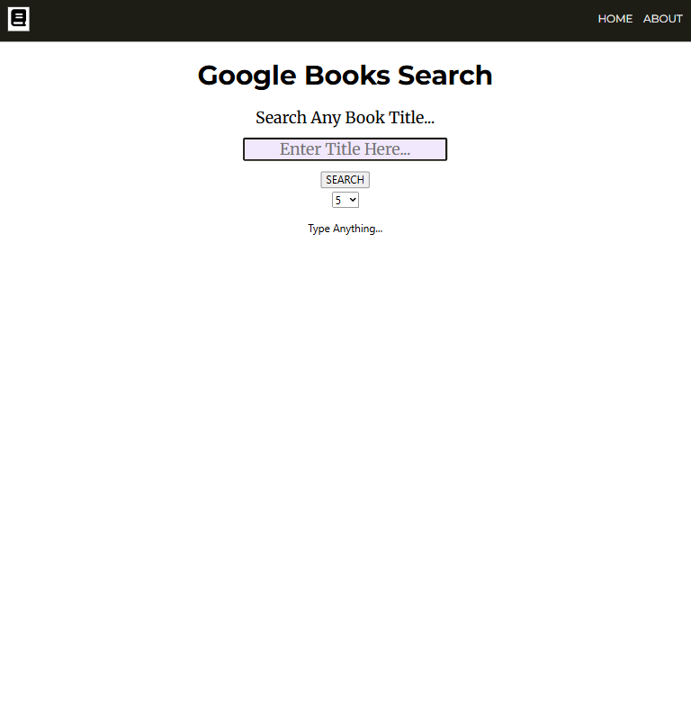
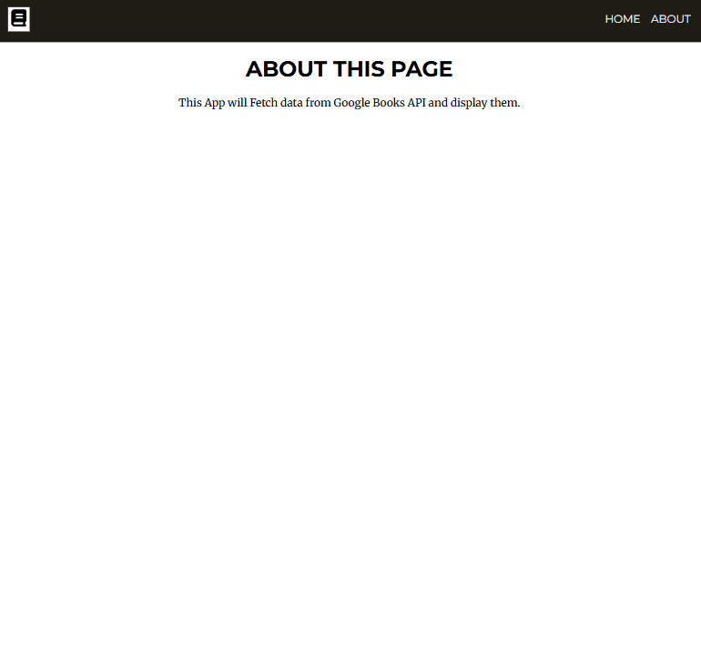
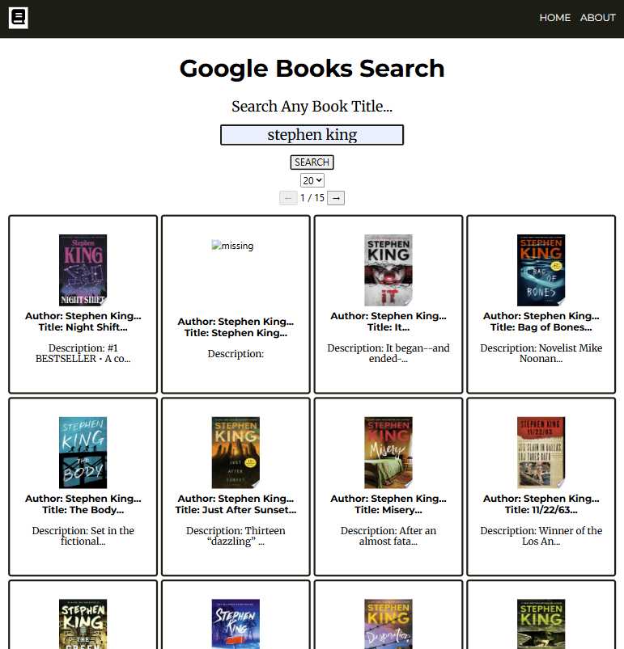
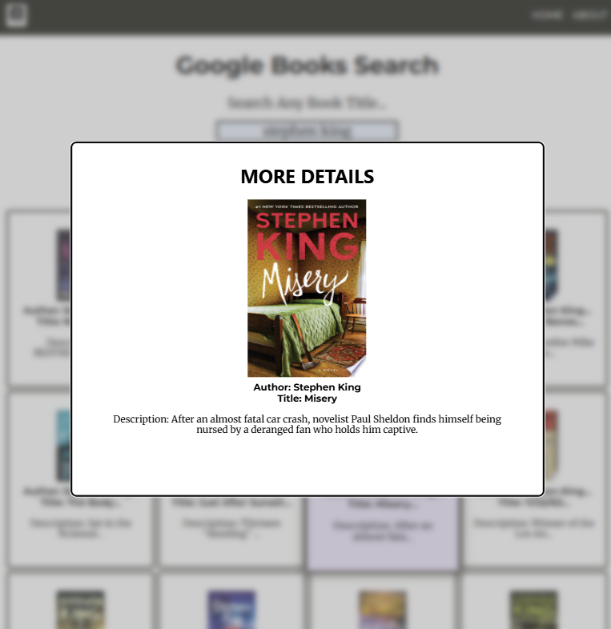

[Template used](https://github.com/nology-tech/react-scss-template)
| [API used](https://books.google.com.au/)

# Google Books API

Project invovles fetching data from Google Books API and displays a grid of books based off search. Books detailed are truncated but further descriptions revealed upon clicking.

# Overview

Home Screen | About Full

Home Screen Search | Home Screen Modal

## MVP

- Add Header section
- Add Input field + submit button
- Dynamically populate grid based off books fetched
- Books must contain image, author, title, description
- Responsive grid
- Separate files/components
- Testing REACT components
- Styling

## BONUS

- Added basic About page
- Add Modal that displays further details
- Error handling
- Testing/Mocking

## Techstack

- [x] HTML5
- [x] Javacript ES6+
- [x] CSS/SASS
- [x] react
- [x] jsx
- [x] vitest/jest

## Takeaways

- Learnt how to develop front end page with react and respective .jsx files.
- Learnt how to export and import respective elements through react's virtual DOM.
- Learnt how to fetch from API with KEY.
- Tested independent components with Vitest and mocked parameters and fields to test features.
- Used Tailwinds color pallete.
- Used .useEffect Hook to help with rerenders
- Used useState & useRef to store different variables and their respective Setters.
- Learnt basics of routing pages
- Implemented Modal via \<label> tag.
- Separated components, files and pages into individual components to help with testing.
